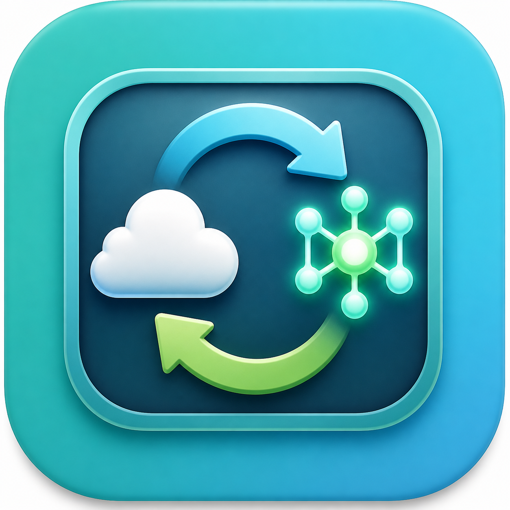

# Codex App かんたん切り替え



ターミナルを使ったことがない人でも、ボタン操作だけでCodex Appの接続先を切り替え、
OllamaのCloudモデル・ローカルモデルを管理できるmacOS / Windows向けGUIアプリです。

初期値・推奨モデルはOllama Cloudの`gpt-oss:120b-cloud`です。Cloudモデルを優先して
分かりやすく表示し、ローカルモデルとモデル名の手入力は詳細設定にまとめています。

## 初心者向けダウンロード

最新版の配布ページ:

- [GitHub Releasesから最新版を選ぶ](https://github.com/aikiti/codex-app-easy-switcher/releases/latest)
- [Mac版（安定版v0.2.0）を直接ダウンロード](https://github.com/aikiti/codex-app-easy-switcher/releases/download/v0.2.0/Codex-App-Easy-Switcher-macOS.zip)
- [Windows版EXEを直接ダウンロード](https://github.com/aikiti/codex-app-easy-switcher/releases/download/v0.3.0/Codex-App-Easy-Switcher-Windows.exe)

MacではZIPを展開してアプリを起動します。WindowsではEXEをダブルクリックします。
Mac版v0.2.0は実機確認済みです。Windows版v0.3.0はGitHub Actions上のビルドと自動テストを
通していますが、Windows実機での操作確認はこれから行います。

## 配布物と文書

- 配布用アプリ: `dist/Codex App かんたん切り替え.app`
- 配布用ZIP: `dist/Codex-App-Easy-Switcher-macOS.zip`
- Windows配布用EXE: `dist/Codex-App-Easy-Switcher-Windows.exe`
- [仕様書（Markdown）](docs/SPECIFICATION.md)
- [操作マニュアル（Markdown）](docs/USER_MANUAL.md)
- `docs/Codex_App_かんたん切り替え_仕様書.docx`
- `docs/Codex_App_かんたん切り替え_操作マニュアル.docx`
- [セキュリティ方針](SECURITY.md)

## 主な機能

### Codex Appの接続先切り替え

- 通常のCodex GPTでCodex Appを起動
- 選択したOllamaモデルでCodex Appを起動
- 推奨モデル`gpt-oss:120b-cloud`へボタンで戻す
- 推奨・Cloud・ローカルモデルを分けた初心者向け選択画面
- 選択したモデル名・種類・準備状態を常時表示
- 未準備モデルは起動せず、モデル管理画面へ案内
- ローカルモデル利用時は、Codexの機能が正常に動作しない可能性を毎回警告
- Codex App終了前に未送信内容が失われる可能性を警告

モデルを選択しただけではCodex Appを再起動しません。「選択中のOllamaモデルで起動」を
押したときだけ、Ollama公式機能で接続先を切り替えます。

```text
ollama launch codex-app --model <選択したモデル> --yes
ollama launch codex-app --restore --yes
```

このアプリ自身は`~/.codex/config.toml`を書き換えません。状態表示のために読み取り、
設定変更・バックアップ・復元はOllama Launchへ委譲します。

### Ollamaモデル管理

- インストール済みモデルをCloud優先で一覧表示
- Cloudモデルとローカルモデルを区別
- 手入力したモデルを確認後にインストール
- インストール進捗表示と中止
- 大容量通信・ディスク使用の可能性を開始前に警告

モデル削除とOllama自体の自動インストールは行いません。

## 必要なもの

- arm64 macOS 12以降、またはWindows版Codex Appが動作するWindows
- Codex App
- Ollama v0.24.0以降
- Ollama Cloudモデルを使う場合はOllamaへのサインインとインターネット接続

配布アプリはPythonを内蔵しています。ソースから起動する場合のみ、Tkinterを含むPython 3が
必要です。

## macOSでの起動方法

Finderで`Codex App かんたん切り替え.app`をダブルクリックします。ターミナルは表示されません。

初回起動時にmacOSの警告が表示された場合は、アプリを右クリックして「開く」を選択します。
初回の接続切り替え時にCodex Appを制御する許可を求められた場合は許可してください。

## Windowsでの起動方法

1. GitHub Releaseから`Codex-App-Easy-Switcher-Windows.exe`をダウンロードします。
2. EXEをダブルクリックします。コマンドプロンプトは表示されません。
3. Windows SmartScreenが表示された場合は、ダウンロード元とSHA256を確認してから
   「詳細情報」→「実行」を選びます。

Windows版EXEはコード署名証明書による署名を行っていないため、初回起動時に警告される場合が
あります。GitHub以外から入手したEXEは実行しないでください。

開発時はmacOS / Windowsともに次でも起動できます。

```bash
python3 app.py
```

## 基本操作

### 推奨モデルを使う

初期状態では`gpt-oss:120b-cloud`が選択されています。「選択中のOllamaモデルで起動」を
押すと、Ollama Cloud経由でCodex Appを起動します。

### Codex App用モデルを変更する

1. 「モデルを変更」を押します。
2. 推奨モデルまたはCloudモデル一覧から選びます。
3. ローカルモデルを使う場合だけ「詳細設定を表示」を開きます。
4. メイン画面へ戻り、「選択中のOllamaモデルで起動」を押します。

選択したモデルが未準備の場合、起動せず「Ollama モデル管理」タブへ案内します。

### 通常のCodex GPTへ戻す

「通常のCodex GPTで起動」を押します。Ollama Launchが保存したバックアップから通常の
Codex設定へ復元し、Codex Appを起動します。

### 新しいモデルをインストールする

「Ollama モデル管理」タブでOllama公式ライブラリのモデル名を入力し、
「モデルをインストール」を押します。

## 安全設計

- Cloudモデルと推奨モデルを優先表示
- ローカルモデルは詳細設定内に分離し、選択時・起動時に警告
- モデル変更だけではCodex Appを終了・再起動しない
- subprocessは引数リスト形式で実行し、`shell=True`を使用しない
- 危険な文字を含むモデル名を拒否
- 切り替え前にCodex Appを安全に終了
- Windowsでは固定PowerShell処理で通常終了を依頼し、強制終了しない
- Windowsでは子プロセスのコマンド画面を表示しない
- ランチャー終了時にOllama接続を戻し忘れないよう警告
- モデルの自動削除や無確認の大容量ダウンロードを行わない

## 公開・配布時の注意

APIキー、認証情報、個人用パスは含めていません。アプリはプロンプトやプロジェクト内容を
収集・送信しません。

接続切り替え時にはCodex Appが終了・再起動され、Ollama公式機能が
`~/.codex/config.toml`を変更・復元します。未送信内容が失われる可能性があります。

macOS配布アプリはarm64向けのアドホック署名版で、Apple公証は未実施です。
Windows配布EXEはGitHub Actionsで生成し、コード署名証明書による署名は未実施です。

## 開発者向けテスト

重要: Codex App内のCodexから開発・検証中は、実際の切り替えボタンや
`ollama launch codex-app --restore`を実行しないでください。切り替え処理はモックを使った
自動テストで確認します。

```bash
PYTHONDONTWRITEBYTECODE=1 python3 -m unittest discover -s tests -v
python3 app.py --smoke-test
```

## 配布アプリのビルド

PyInstallerをインストール後、次を実行します。

```bash
scripts/build_icon.sh
scripts/build_macos_app.sh
```

Windows版はタグをGitHubへpushすると、`.github/workflows/windows-release.yml`が
Windows環境でテスト・EXE生成・Release添付を自動実行します。ローカルのWindows環境では
次でもビルドできます。

```powershell
python -m pip install pyinstaller==6.17.0 pillow
.\scripts\build_windows_app.ps1
```
